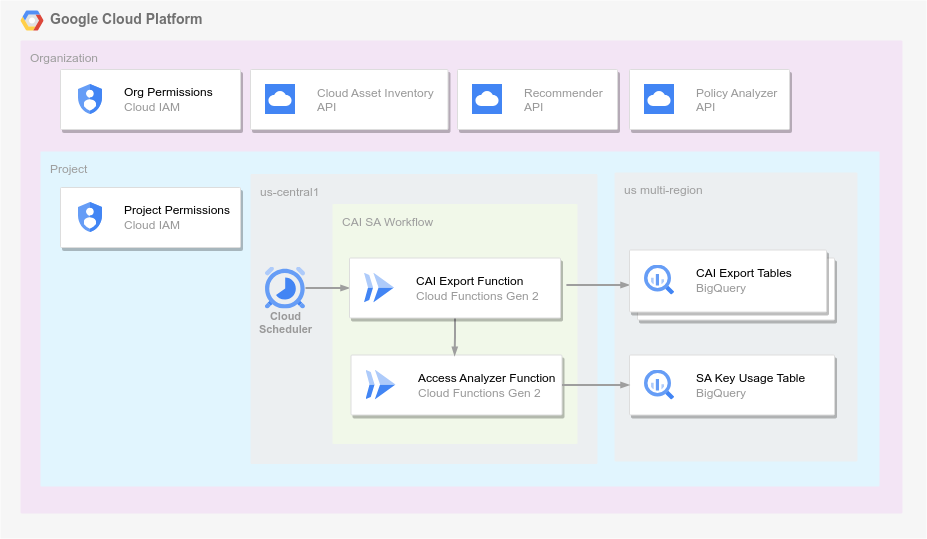

# Migrate from service account keys to more secure authentication methods

One common authentication method to access Google Cloud services is using a
[service account key](https://cloud.google.com/iam/docs/keys-create-delete),
but service account keys create a security risk because an attacker or
malicious insider could abuse the permissions of the service account if the
credentials are exposed. However, in many cases, you can authenticate with
[more secure alternatives to service account keys](https://cloud.google.com/docs/authentication#auth-decision-tree).
This repository produces a data pipeline to help you assess service account key usage,
as described in the Assess phase of the Google Cloud documentation
[migrate from service account keys to more secure alternatives](https://cloud.google.com/iam/docs/migrate-from-service-account-keys).

Google Cloud provides several services to help you assess where and how service account keys are in use in your organization.
- [Cloud Asset Inventory](https://cloud.google.com/asset-inventory/docs/overview) provides data of resources in your organization.
- [Activity Analyzer](https://cloud.google.com/policy-intelligence/docs/activity-analyzer-service-account-authentication) shows you when your service accounts and keys were last used to call a Google API
- [IAM Recommender](https://cloud.google.com/policy-intelligence/docs/review-apply-role-recommendations) creates recommendations for IAM policies that grant excessive and unused privileges.

 By deploying the code in this repository, you will create a data pipeline that combines information from these sources into a single table. You can query this table or visualize it in your preferred dashboard tools to help assess where keys are used and how to improve your security stance.

## Architecture

The following diagram shows an example implementation of this data pipeline.



The preceding diagram shows the following:
- Cloud Scheduler triggers a daily workflow.
- In the workflow, a Cloud Function runs code that queries Cloud Asset Inventory for service account keys and writes data to BigQuery.
- The first Function triggers a second Function that enriches the CAI export with additional information about key usage from the Policy Analyzer and Recommender services. This data is written to the Service Account Key Usage table in BigQuery.
- Resources are only created and modified in a single designated project. However, these functions require privileged IAM roles at the organization node in order to query data about service account keys in all projects under your organization.


### Tables

| # | BigQuery Table | Data Description |
|---|----------|-------------|
| 1 | CAI IAM Export            | Cloud Asset Inventory (CAI) IAM export, filtered to assetType `iam.googleapis.com/ServiceAccount' or 'iam.googleapis.com/ServiceAccountKey' |
| 2 | Service Account Key Usage | Service Account Key usage data, combining data from the CAI IAM Export table, IAM Recommender service, and Policy Analyzer service |

## Deploying the infrastructure

The following sections introduce the steps necessary to deploy this sample code.

### Before you begin

1. To deploy this repository using an online terminal with software preconfigured, use [Cloud Shell](https://shell.cloud.google.com/?show=ide%2Cterminal).

   To deploy this repository using a local terminal:
    1. [install](https://cloud.google.com/sdk/docs/install) and [initialize](https://cloud.google.com/sdk/docs/initializing) the gcloud CLI
    1. [install Terraform](https://developer.hashicorp.com/terraform/tutorials/gcp-get-started/install-cli)
    1. [install the git CLI](https://github.com/git-guides/install-git)
    1. [set up application default credentials](https://cloud.google.com/docs/authentication/provide-credentials-adc)

2. [Create or select a Google Cloud project](https://cloud.google.com/resource-manager/docs/creating-managing-projects) that is part of an organization resource. If you don't already have a Google Cloud organization, see [creating and managing an organization](https://cloud.google.com/resource-manager/docs/creating-managing-organization).

3. Make sure that [billing is enabled for your Google Cloud project](https://cloud.google.com/billing/docs/how-to/verify-billing-enabled#console).

4. Grant IAM roles at the project level. Run the following command to [grant IAM roles](https://cloud.google.com/iam/docs/granting-changing-revoking-access#single-role) and ensure that the principal deploying this repository has the minimum necessary privilege at the project.
   - Replace `PROJECT_ID` with your project ID.
   - Replace `PRINCIPAL`with the identity used to deploy the repository, in the format "user:EMAIL_ADDRESS" or "serviceAccount:SERVICE_ACCOUNT_EMAIL_ADDRESS"
```bash
cat << EOF > project_roles.txt
roles/bigquery.admin
roles/cloudfunctions.admin
roles/cloudscheduler.admin
roles/iam.serviceAccountAdmin
roles/iam.serviceAccountUser
roles/resourcemanager.projectIamAdmin
roles/serviceusage.serviceUsageAdmin
roles/storage.admin
roles/workflows.admin
EOF

#replace this with your project ID
export PROJECT_ID=<PROJECT_ID>
#replace this with the identity used to deploy the repository, in the format "user:EMAIL_ADDRESS" or "serviceAccount:SERVICE_ACCOUNT_EMAIL_ADDRESS"
export PRINCIPAL=<YOUR_IDENTITY>

for ROLE in $(cat project_roles.txt)
do
  gcloud projects add-iam-policy-binding $PROJECT_ID --member=$PRINCIPAL --role=$ROLE
done
```

5. Grant roles at the organization level. Run the following command to [grant IAM roles](https://cloud.google.com/iam/docs/granting-changing-revoking-access#single-role) and ensure that the principal deploying this repository has the minimum necessary privilege at the organization.
   - Note: If you don't have the ability to grant roles at the organization level, you will need to take additional manual steps in the Terraform deployment stage and work with your organization admin to manually configure org-level IAM policies and enable services.
   - Replace `ORG_ID` with your organization ID.
   - Replace `PRINCIPAL`with the identity used to deploy the repository, in the format "user:EMAIL_ADDRESS" or "serviceAccount:SERVICE_ACCOUNT_EMAIL_ADDRESS"

```bash
cat << EOF > org_roles.txt
roles/iam.organizationRoleAdmin
roles/resourcemanager.organizationAdmin
EOF

#replace this with your org ID
export ORG_ID=<ORG_ID>
#replace this with the identity used to deploy the repository, in the format "user:EMAIL_ADDRESS" or "serviceAccount:SERVICE_ACCOUNT_EMAIL_ADDRESS"
export PRINCIPAL=<YOUR_IDENTITY>

for ROLE in $(cat org_roles.txt)
do
  gcloud organizations add-iam-policy-binding $ORG_ID --member=$PRINCIPAL --role=$ROLE
done
```

6. Run the following bootstrap script to enable necessary APIs across all projects in your organization. Although the services required by your Terraform deployment are enabled in a single project as part of the Terraform code, querying data from the Recommender and Policy Analyzer APIs requires an additional enablement step for other projects.

```bash
# Replace this with your organization ID
ORG_ID=YOUR_ORG_ID

# Loop through all projects in the organization
for PROJECT in $(gcloud alpha projects list --organization=$ORG_ID --format="value(projectId)")
do
    # Enable Recommender API for each project
    gcloud services enable recommender.googleapis.com policyanalyzer.googleapis.com --project=$PROJECT
    echo "Recommender and Policy Analyzer APIs enabled for project: $PROJECT"
done
```

Consider how you will enable these services in future projects as well. It is recommended to enable these services consistently as part of your standard process or automation for project creation.

### Set Terraform variables and deploy

1. From your terminal, clone this repository and navigate into the `/terraform` directory by running the following commands:

```bash
git clone https://github.com/GoogleCloudPlatform/migrate-from-service-account-keys
cd migrate-from-service-account-keys/terraform
```

2. Use your preferred editor to modify the `terraform.tfvars` file. Set `org_id` and `project_id` with the specific values for your environment.

3. (Optional) You can also overwrite the default values for other variables such as the location of your resources. Review the file `terraform/variables.tf` to see configurable variables, and then add your custom values to `terraform.tfvars`.

4. (Optional) If you are unable to grant IAM roles at the organization node, set the variable `provision_org_iam: false`. When this variable is set, Terraform will not deploy the following IAM resources:

```bash
resource "google_organization_iam_custom_role" "custom_cai_export_org_role" { ... }
resource "google_organization_iam_binding" "cai_export_organization_binding" { ... }
resource "google_organization_iam_member" "access_analyzer_organization_binding" { ... }
```

In this scenario, work with your organization administrators to grant these IAM roles after you deploy resources from Terraform.

5. Run the following within the `/terraform` directory:

```bash
terraform init
terraform apply
```

### (optional) Manually trigger the scheduled workflow

After the infrastructure is deployed, BigQuery datasets will not have data until the Cloud Functions have run. These Functions are automatically invoked daily using a Scheduler and Workflow at 05:00 UTC.
To test your deployment quickly, you can also [manually execute the workflow](https://cloud.google.com/workflows/docs/executing-workflow), but be aware that trigering the workflow multiple times in a day results in duplicate rows.

### Clean up

4. To clean up the infrastructure created by Terraform, run the following command within the directory.
```bash
terraform destroy
```

*Note: Terrafrom will not disable all APIs when you destroy the infrastructure due to interdependencies on Google services.*

You can then undo the remaining changes, including service enablement and the bootstrap project IAM roles, by [deleting the project](https://cloud.google.com/resource-manager/docs/creating-managing-projects#shutting_down_projects).


## Sample query usage

The following sections introduce questions you can answer by querying this dataset while preparing for your migration. [Run an interactive query in BigQuery](https://cloud.google.com/bigquery/docs/running-queries#queries) and replace `PROJECT_ID` in the `FROM` statement with the value of your project ID.

### How many persistent keys have been created?

```sql
SELECT
  COUNT(Keys.keyID) as keys
FROM `PROJECT_ID.sa_key_usage.key_usage`
WHERE TIMESTAMP_TRUNC(requestTime, DAY) = TIMESTAMP("2023-09-07")
```
This number can be useful as a high-level metric to track progress as you migrate away from keys.

### Which projects use service account keys to authenticate?

```sql
SELECT
  project as project,
  principalName as service_account,
  COUNT(Keys.keyID) as keys
FROM `PROJECT_ID.sa_key_usage.key_usage`
WHERE TIMESTAMP_TRUNC(requestTime, DAY) = TIMESTAMP("2023-09-07")
GROUP BY 1,2
```

When remediating workloads that currently use service account keys, you need to identify the workload owners responsible for those resources.


### Which keys are inactive?

```sql
SELECT
  project as project,
  principalName as service_account,
  Keys.keyID as keyID,
  Keys.creationTime
FROM `PROJECT_ID.sa_key_usage.key_usage`
WHERE TIMESTAMP_TRUNC(requestTime, DAY) = TIMESTAMP("2023-09-07")
#filter to keys that have not been used, or created before usage data is likely to be available
AND keys.lastUse is NULL
AND keys.creationTime < TIMESTAMP_SUB(CURRENT_TIMESTAMP(), INTERVAL 2 DAY)
```

These keys are likely candidates to clean up without further remediation work to existing workloads.

### Are keys associated with service accounts that have overly privileged IAM roles?

```sql
SELECT
  project as project,
  principalName as service_account,
  recommenderSubtype,
  recommenderDescription,
  recommenderPriority,
  recommenderRevokedIamPermissionsCount
FROM `PROJECT_ID.sa_key_usage.key_usage`
WHERE TIMESTAMP_TRUNC(requestTime, DAY) = TIMESTAMP("2023-09-07")
ORDER BY recommenderRevokedIamPermissionsCount desc
```

These recommendations might indicate that a service account key is particularly high risk. You might treat these workloads as high priority to migrate, and you should additionally review the IAM recommendation to apply the principle of least privilege to the service account.

## Notes on data freshness

The data produced by this pipeline does not represent the real-time state of your environment. As you monitor progress removing keys, keep in mind the following limitations on data freshness:

- The pipeline itself runs once daily
- Source data from Cloud Asset Inventory (showing where keys exist) is near real-time
- Source data from The IAM Recommender API (showing service accounts with excessive permission) is not real-time. Role recommendations are not generated until it has a certain number of days of permission usage data. See [observation period](https://cloud.google.com/policy-intelligence/docs/role-recommendations-overview#observation-period) for more information.
- Source data from the Activity Analyzer API (showing when keys were last used to authenticate) is not real-time. These results are produced in batch and might lag a day or more from real usage. If you need to investigate usage for an individual key in real-time, use Cloud Logging.
- This pipeline does not backfill historical data. You can query data from previous dates using the partitioned table, for dates after you have created the pipeline.